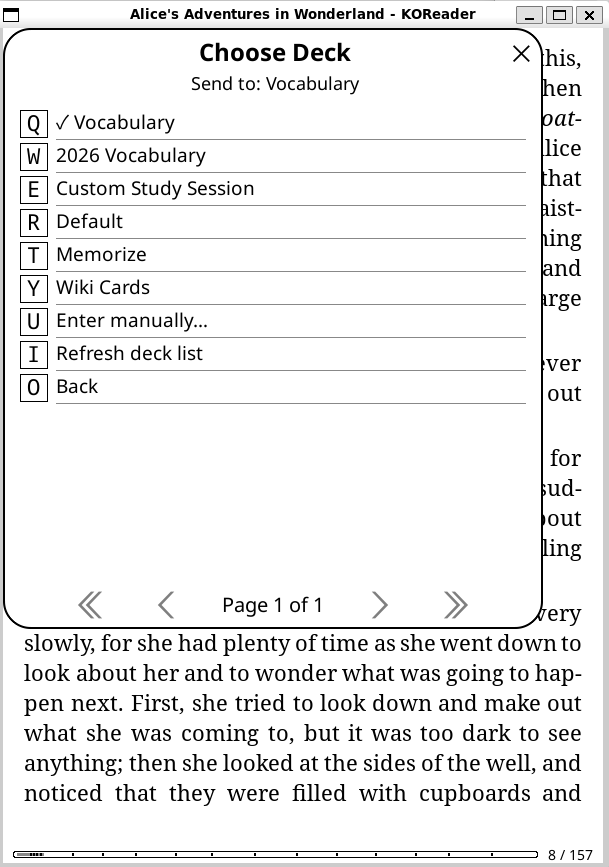
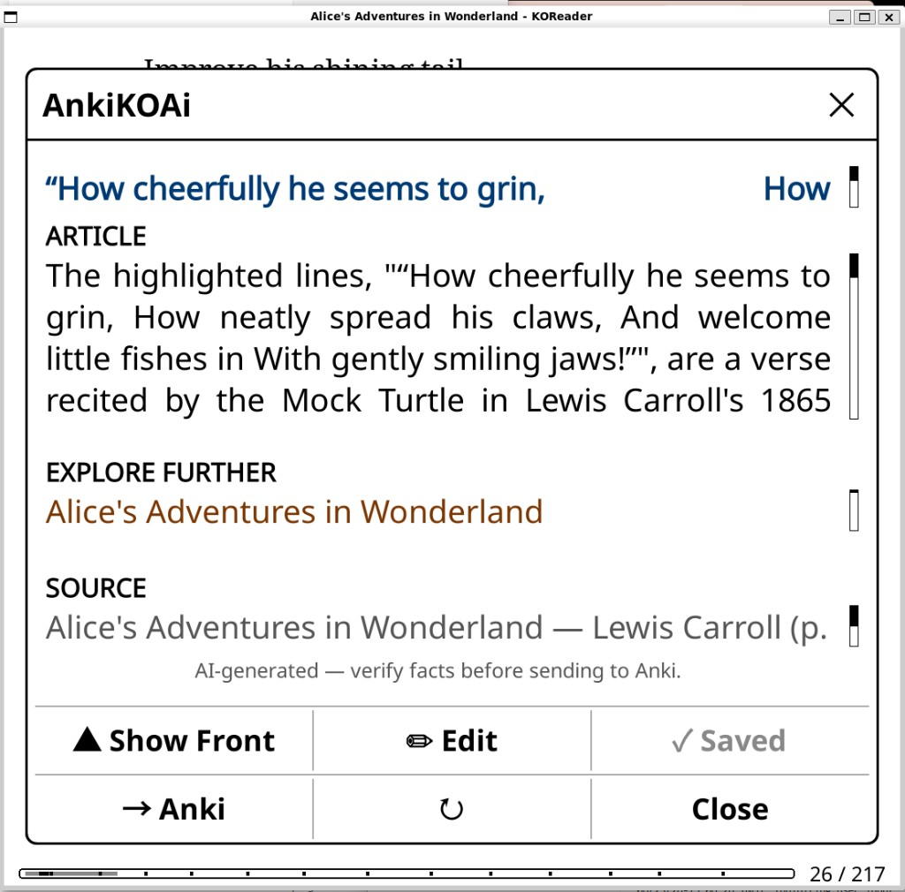
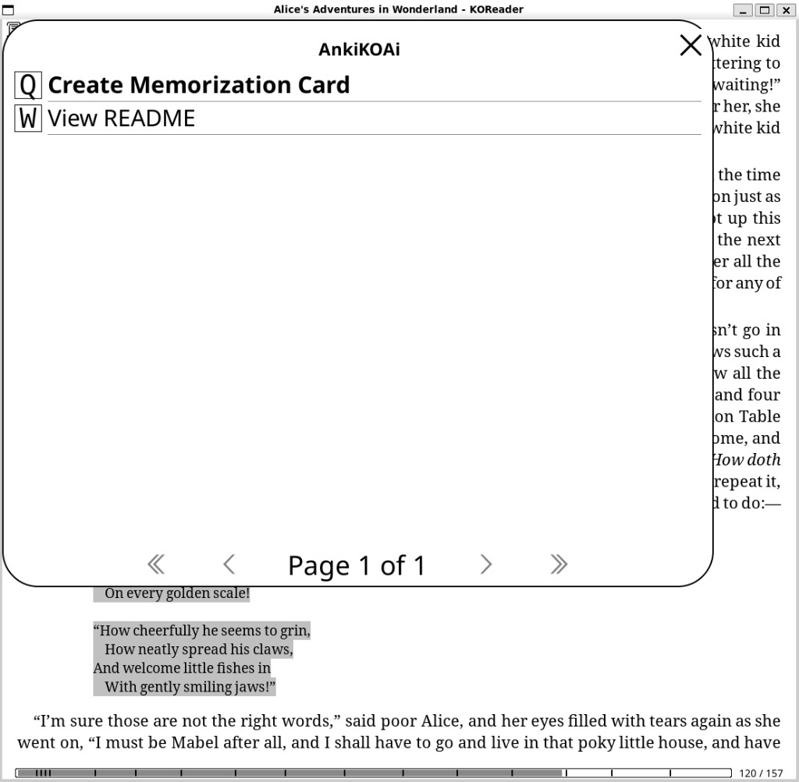
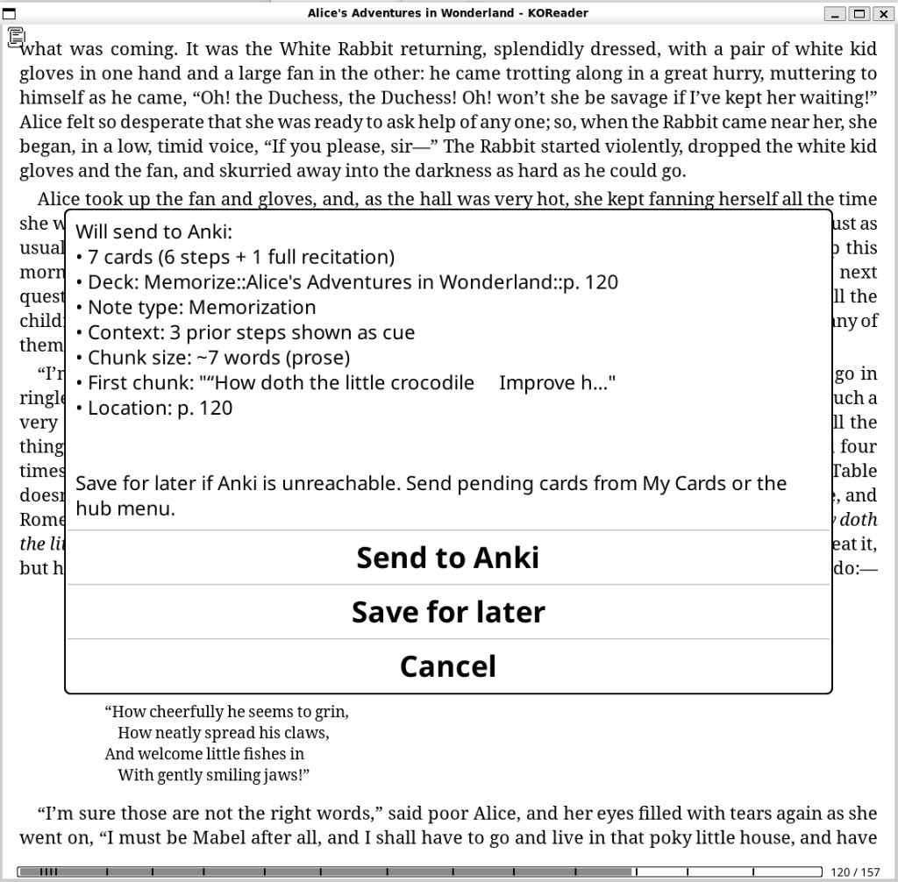
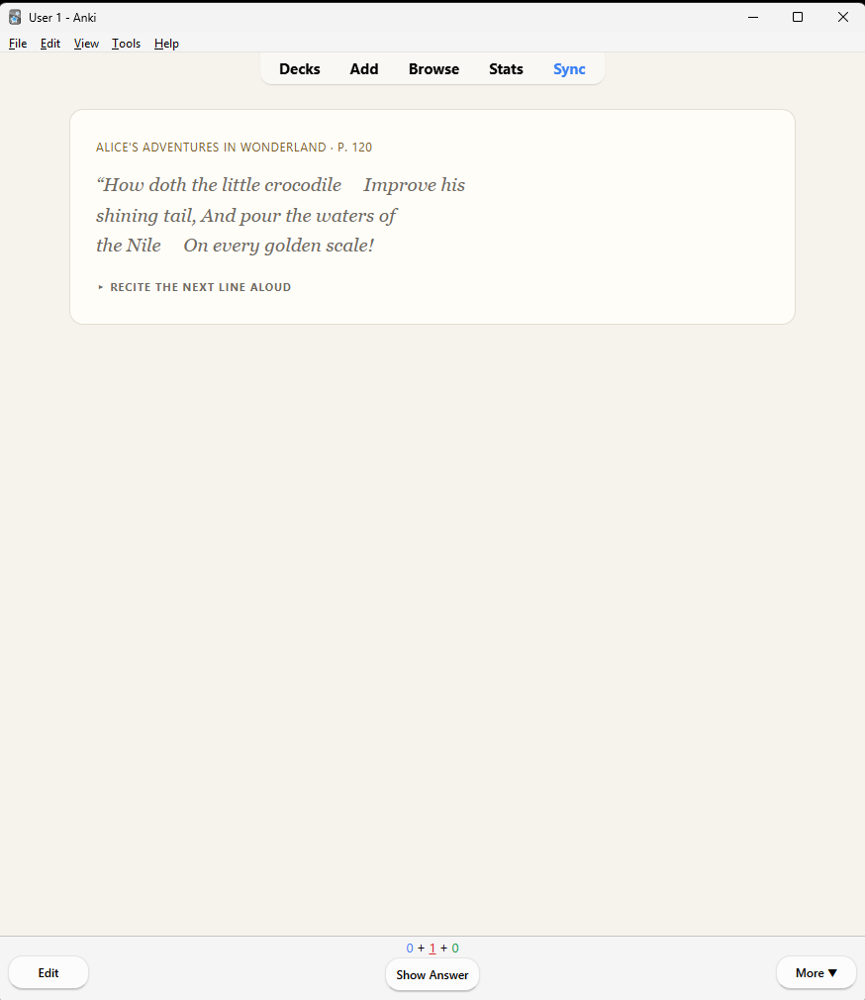

# AnkiKOAi

KOReader plugin: long-press a word or highlight a passage while reading → AI vocabulary cards or LPCG-style memorization decks → sync to Anki via [AnkiConnect](https://foosoft.net/projects/anki-connect/).

Works on Kobo, Kindle (with KOReader), and the KOReader desktop emulator.

Unlike manually exporting highlights, AnkiKOAi builds finished, formatted cards (AI articles, dictionary definitions, or memorization steps) and sends them straight to Anki over your Wi‑Fi — no cables, no copy‑paste.

## Demo

From a highlight to a finished Anki card, without leaving your book:

| 1. Long-press / highlight | 2. Review the card | 3. Pick an Anki deck |
|---|---|---|
|  |  |  |

The card lands in desktop Anki, ready to study:


### Wiki Card (AI)

The AI **Wiki Card** turns a highlight into a reading note: a written-up article plus "Explore further" Wikipedia links, with the source citation. On the device, then synced to Anki:

| On the device | In Anki |
|---|---|
|  |  |

### Memorization (poetry & prose)

Highlight a poem or passage and AnkiKOAi builds LPCG-style overlapping step cards plus a full-recitation card:

| 1. Create Memorization Card | 2. Confirm the deck | 3. Step card in Anki |
|---|---|---|
|  |  |  |

<!-- Optional: add a short screen recording as docs/images/demo.gif and embed it above for social posts. -->


## Features

- **Wiki Card (AI)** — Wikipedia/Wiktionary + AI turn a highlight into a reading note (term on front, article + Wikipedia links on back)
- **Vocabulary Card (No AI)** — KOReader dictionary lookup only — definition + passage, no AI
- **Memorization Card (No AI, Multi-Line)** — overlapping step cards + full-recitation card for poetry and prose ([AnkiLPCG](https://ankilpcg.readthedocs.io/)-style)
- **AnkiConnect** — send to desktop Anki; optional auto-sync to AnkiWeb after send
- **My Cards** — pending outbox only; **Recently sent** log for confirmed sends; manual batch send shows **Sending… N/M** progress; batch send reconciles duplicates/timeouts and removes cards from the queue
- **View All Highlights** — checklist of highlights from the current book (or **Switch book…** for any book in history): multi-select, **Delete Selected Highlights** (open book only), batch send as Wiki/Vocab/Memorization; **Sync All Highlights** when [Tag Bank](https://github.com/3gnome/tagbankhighlightsync.koplugin) is installed
- **Settings UI** — Card defaults (note types, decks, one-tap send), AI providers, memorization behavior, sync; gray rows = tap for help (no file editing on device)
- **One-tap send** — per card type: skip note-type/deck prompts and send straight to your default deck
- **Multiple AI providers** — DashScope, Gemini, OpenAI, OpenRouter

## Quick start

1. Install the plugin into `koreader/plugins/AnkiKOAi.koplugin/`
2. Set up three Anki note types: **Wiki Card**, **Vocabulary Card**, and **Memorization**
3. Configure AnkiConnect on your PC and enter your LAN URL in plugin Settings
4. Long-press a word or highlight text → **View All Highlights**, **AnkiKOAi**, or **Memorize** (scroll the highlight menu). **AnkiKOAi** opens the hub for card types, **My Cards**, and settings. Or long-press → **Dictionary** → **AnkiKOAi** or **Create Vocab Card**.

**Full walkthrough:** [docs/getting-started.md](docs/getting-started.md)

## Documentation

| Guide | Contents |
|-------|----------|
| [Documentation index](docs/README.md) | Overview of all guides |
| [Getting started](docs/getting-started.md) | Install, AnkiConnect, first card |
| [Tag Bank companion](docs/tag-bank-companion.md) | Optional tags, JSON sync, Obsidian quote library |
| [WebDAV setup (Windows)](docs/webdav-setup-windows.md) | Local WebDAV for Tag Bank on home Wi‑Fi |
| [Plugin & recent work summary](docs/plugin-and-recent-work-summary.md) | Architecture, TagBank companion, dev session notes |
| [Plugin configuration](docs/plugin-configuration.md) | API keys, settings UI, `configuration.lua` |
| [Anki: Wiki Card setup](docs/anki-vocabulary.md) | AI + wiki note type, templates, CSS, deck options |
| [Anki: Vocabulary Card setup](docs/anki-vocabulary-card.md) | Dictionary-only note type (no AI) |
| [Anki: Memorization deck](docs/anki-memorization.md) | Step/full cards, deck hierarchy, weekly routine |
| [Desktop copy-paste templates](docs/desktop/) | Front/back HTML + CSS for all three note types |
| [anki-memorization-setup.txt](anki-memorization-setup.txt) | Memorization templates (same as `docs/desktop/memorization-anki-templates.txt`) |
| [Publishing & discoverability](docs/publishing.md) | GitHub, releases, KOReader AppStore, SEO |
| [Announcement posts](docs/announcements.md) | Ready-to-paste posts for MobileRead, Reddit, Anki forums |

On your e-reader, tap **View README** in each card submenu for what that card type does (fields, decks, settings). Copy Anki templates and CSS on your computer from [docs/desktop/](docs/desktop/) — not from the e-reader screen.

## Requirements

| Component | Purpose |
|-----------|---------|
| [KOReader](https://koreader.rocks/) | E-reader app |
| [Anki](https://apps.ankiweb.net/) + [AnkiConnect](https://foosoft.net/projects/anki-connect/) | Desktop on same Wi‑Fi as your device |
| AI API key | For **Wiki Card (AI)** only — DashScope, Gemini, OpenAI, or OpenRouter |
| StarDict dictionaries | For **Vocabulary Card (No AI)** — install in KOReader |
| Anki note types | **Wiki Card**, **Vocabulary Card**, and **Memorization** — see docs above |

## Wiki Card (AI)

A **Wiki Card** is not a traditional question→answer flashcard. Highlight a word or phrase while reading and AnkiKOAi will:

1. Pull excerpts from **Wikipedia / Wiktionary** (when enabled and online)
2. Add the **surrounding passage** from your book
3. Use **AI** to write a Wikipedia-style **article** for the back of the card
4. Add **real Wikipedia links** you can tap to explore further in Anki

You review the note in KOReader, then send it to Anki. On study, the **term** is on the front; the **article and explore links** are on the back.

### Set up Anki first (required)

Create an Anki note type named **Wiki Card** with these **exact field names** (order matters for templates):

| Field | Purpose |
|-------|---------|
| Phrase | Highlighted term (front) |
| Text | Wikipedia-style article (back) |
| Links | Real Wikipedia URLs (filled by plugin) |
| Source | Book title, author, page (filled by plugin) |
| Definition | Optional short lede |
| IPA | Optional pronunciation hint |
| Synonyms | Legacy; usually empty |

Copy-paste **front/back templates, CSS, and deck study settings**:

→ **[docs/anki-vocabulary.md](docs/anki-vocabulary.md)** (Wiki Card setup guide)

Default deck: `English::Koreader`. Configure note type and **One-tap send (Wiki)** under **Settings → Card defaults → Wiki Card**.

## Vocabulary Card (No AI)

For a simpler card from your **in-app dictionary** only — no AI, no wiki:

1. Install StarDict dictionaries in KOReader
2. Create Anki note type **Vocabulary Card** with fields `Phrase`, `Definition`, `Context`, `Source`
3. **Long-press** a word → **Create Vocab Card**, or highlight → **AnkiKOAi → Vocabulary Card (No AI)**

→ **[docs/anki-vocabulary-card.md](docs/anki-vocabulary-card.md)** (full setup guide)

## Installation

1. Copy this folder to your device:

   ```
   koreader/plugins/AnkiKOAi.koplugin/
   ```

   (Folder name must end in `.koplugin`.)

2. Create local config from the sample (optional if you use Settings on device):

   ```bash
   cp configuration.lua.sample configuration.lua
   ```

   Edit `configuration.lua` with your API key and AnkiConnect URL, **or** enter them in **AnkiKOAi → Settings** on the device (recommended on Kobo).

3. On the PC running Anki:
   - Install AnkiConnect (Tools → Add-ons → `2055492159`)
   - Use your PC’s **LAN IP** in the plugin, not `localhost`

4. Restart KOReader.

## Anki setup (required)

The plugin sends notes via AnkiConnect — field names and note types must exist in Anki first.

| Workflow | Plugin menu | Anki note type | Default deck | Setup guide |
|----------|-------------|----------------|--------------|-------------|
| Wiki Card (AI) | Wiki Card (AI) | Wiki Card | `English::Koreader` | [anki-vocabulary.md](docs/anki-vocabulary.md) |
| Vocabulary Card (No AI) | Vocabulary Card (No AI) | Vocabulary Card | `English::Koreader` | [anki-vocabulary-card.md](docs/anki-vocabulary-card.md) |
| Memorization | Memorization Card (No AI, Multi-Line) | Memorization | `Memorize` (+ subdecks) | [anki-memorization.md](docs/anki-memorization.md) |

Create deck-options presets in Anki:

- **Wiki Card** — for AI reading notes (higher daily limits)
- **Vocabulary Card** — for dictionary drill cards (similar limits; can share Wiki Card preset)
- **Memorize** — for step/full cards (lower new-card cap, verbatim tuning)

## Configuration

| Setting | Where |
|---------|--------|
| AnkiConnect URL | **Settings → Anki connection…** or `configuration.lua` → `anki.url` |
| Wiki / Vocabulary / Memorization note types | **Settings → Card defaults…** (per card type) |
| Default deck (Wiki) | **Settings → Card defaults → Wiki Card…** |
| Default deck (Vocabulary) | **Settings → Card defaults → Vocabulary Card…** |
| Hub menu label (Wiki / Vocabulary) | **Settings → Card defaults → Wiki Card…** or **Vocabulary Card…** (empty = default hub text) |
| Memorization parent deck | **Settings → Card defaults → Memorization Card…** |
| Subdeck by book (Wiki/Vocab) | **Settings → Card defaults → Where cards go…** |
| One-tap send (per card type) | **Settings → Card defaults…** |
| Memorization split/context behavior | **Settings → Memorization options…** |
| Sync to AnkiWeb after send | **Settings → Anki connection…** (default ON) |
| API keys | **Settings → AI Settings → API Keys** (Wiki Card only) |
| Send pending when WiFi (every 20 min) | **Settings → Sync…** |

Details: [docs/plugin-configuration.md](docs/plugin-configuration.md). In Settings on device, **tap gray rows for help.**

`configuration.lua` is **gitignored** — never commit API keys or LAN URLs.

## Development (WSL emulator)

```bash
# AnkiKOAi + TagBankHighlightSync: sync both, launch once (recommended)
bash dev-start.sh --emulator alice.epub

# One-time WebDAV + cloud plugin setup (TagBankHighlightSync repo):
# bash /mnt/c/Users/small/tagbankhighlightsync.koplugin/setup-emulator-cloud.sh
# bash /mnt/c/Users/small/tagbankhighlightsync.koplugin/configure-emulator-webdav.sh

# Sync without launching (then launch once manually or via dev-start.sh without --sync-only)
bash dev-start.sh --sync-only

# AnkiKOAi only
bash start.sh --emulator alice.epub
bash start.sh --sync-only
```

Set `KOREADER_DIR` if your emulator is not at `~/koreader-dev/emulator/usr/lib/koreader`.

On WSL, avoid two full emulator launches per session — a second launch often triggers WSLg
`[WARN: COPY MODE]` in the taskbar (not in terminal logs). AppImage from WSL still uses WSLg.

For Cursor / local AI context: copy `LOCAL_DEV.md.sample` → `LOCAL_DEV.md` (gitignored). Open the 3-folder workspace: **Ctrl+Shift+N** → **Ctrl+Shift+P** → **Open Workspace from File...** → `C:\Users\small\koreader-dev.code-workspace` (Glass/Agents cannot open `.code-workspace`; use the Editor). Or: `cursor C:\Users\small\koreader-dev.code-workspace --classic`. Attach `@LOCAL_DEV.md` in chat anytime.

## About this plugin

**AnkiKOAi** connects reading on KOReader to spaced repetition in Anki. Highlight text → **View All Highlights** (browse/delete/batch), **AnkiKOAi** hub → **Wiki Card (AI)**, **Vocabulary Card (No AI)**, **Memorization Card (No AI, Multi-Line)**, **My Cards**, batch highlights, or settings.

## Publishing / cloning safely

- Commit **`configuration.lua.sample`** only (placeholders).
- Do **not** commit `configuration.lua`, `*.json` card/settings files, or `koreader.log`.
- If an API key was ever committed or shared, **revoke and rotate it** in the provider console.

**Publishing to GitHub:** [docs/publishing.md](docs/publishing.md) — repo setup, release zip, GitHub topics (`koreader-plugin` for AppStore), and discoverability.

## License

MIT — see [LICENSE](LICENSE).

## Credits

- Memorization flow inspired by [AnkiLPCG](https://ankilpcg.readthedocs.io/)
- Anki integration via [AnkiConnect](https://foosoft.net/projects/anki-connect/)
