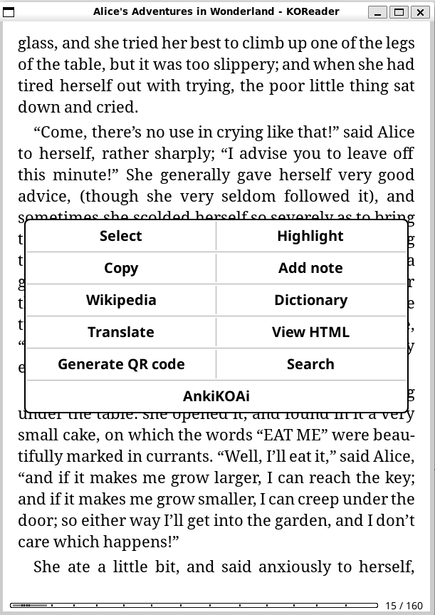
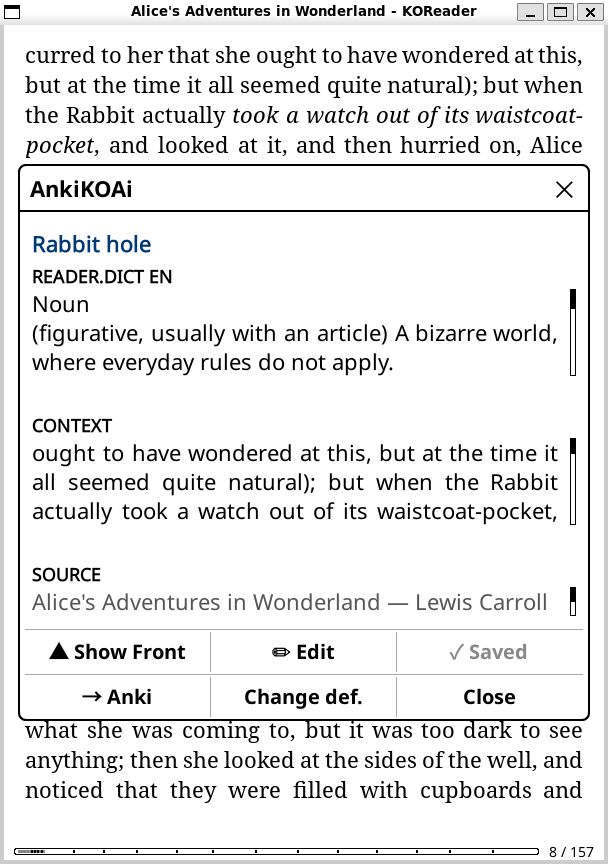
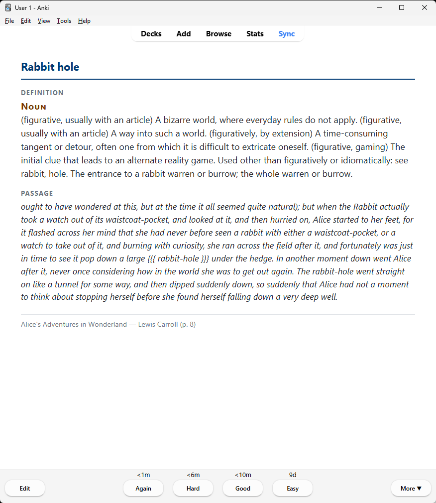

# AnkiKOAi

KOReader plugin: long-press a word or highlight a passage while reading → AI vocabulary cards or LPCG-style memorization decks → sync to Anki via [AnkiConnect](https://foosoft.net/projects/anki-connect/).

Works on Kobo, Kindle (with KOReader), and the KOReader desktop emulator.

Unlike manually exporting highlights, AnkiKOAi builds finished, formatted cards (AI articles, dictionary definitions, or memorization steps) and sends them straight to Anki over your Wi‑Fi — no cables, no copy‑paste.

## Demo

<!--
  Drop your images/GIF into docs/images/ with these exact names and they will render here.
  A short GIF of: long-press/highlight → AnkiKOAi menu → card preview → card in Anki
  is the single best thing for sharing on Reddit, MobileRead, and forums.
-->


| Highlight → menu | Card preview | In Anki |
|---|---|---|
|  |  |  |

## Features

- **Wiki Card (AI)** — Wikipedia/Wiktionary + AI turn a highlight into a reading note (term on front, article + Wikipedia links on back)
- **Vocabulary Card (No AI)** — KOReader dictionary lookup only — definition + passage, no AI
- **Memorization Card (No AI, Multi-Line)** — overlapping step cards + full-recitation card for poetry and prose ([AnkiLPCG](https://ankilpcg.readthedocs.io/)-style)
- **AnkiConnect** — send to desktop Anki; optional auto-sync to AnkiWeb after send
- **Settings UI** — API keys, decks, note types, memorization chunk size, sync options (no file editing on device)
- **Multiple AI providers** — DashScope, Gemini, OpenAI, OpenRouter

## Quick start

1. Install the plugin into `koreader/plugins/AnkiKOAi.koplugin/`
2. Set up three Anki note types: **Wiki Card**, **Vocabulary Card**, and **Memorization**
3. Configure AnkiConnect on your PC and enter your LAN URL in plugin Settings
4. Long-press a word or highlight text → **AnkiKOAi** → choose a card type

**Full walkthrough:** [docs/getting-started.md](docs/getting-started.md)

## Documentation

| Guide | Contents |
|-------|----------|
| [Documentation index](docs/README.md) | Overview of all guides |
| [Getting started](docs/getting-started.md) | Install, AnkiConnect, first card |
| [Plugin configuration](docs/plugin-configuration.md) | API keys, settings UI, `configuration.lua` |
| [Anki: Wiki Card setup](docs/anki-vocabulary.md) | AI + wiki note type, templates, CSS, deck options |
| [Anki: Vocabulary Card setup](docs/anki-vocabulary-card.md) | Dictionary-only note type (no AI) |
| [Anki: Memorization deck](docs/anki-memorization.md) | Step/full cards, deck hierarchy, weekly routine |
| [Desktop copy-paste templates](docs/desktop/) | Front/back HTML + CSS for all three note types |
| [anki-memorization-setup.txt](anki-memorization-setup.txt) | Memorization templates (same as `docs/desktop/memorization-anki-templates.txt`) |
| [Publishing & discoverability](docs/publishing.md) | GitHub, releases, KOReader AppStore, SEO |
| [Announcement posts](docs/announcements.md) | Ready-to-paste posts for MobileRead, Reddit, Anki forums |

On your e-reader, tap **View README** in each card submenu for what that card type does (fields, decks, settings). Copy Anki templates and CSS on your computer from [docs/desktop/](docs/desktop/) — not from the e-reader screen.

## Requirements

| Component | Purpose |
|-----------|---------|
| [KOReader](https://koreader.rocks/) | E-reader app |
| [Anki](https://apps.ankiweb.net/) + [AnkiConnect](https://foosoft.net/projects/anki-connect/) | Desktop on same Wi‑Fi as your device |
| AI API key | For **Wiki Card (AI)** only — DashScope, Gemini, OpenAI, or OpenRouter |
| StarDict dictionaries | For **Vocabulary Card (No AI)** — install in KOReader |
| Anki note types | **Wiki Card**, **Vocabulary Card**, and **Memorization** — see docs above |

## Wiki Card (AI)

A **Wiki Card** is not a traditional question→answer flashcard. Highlight a word or phrase while reading and AnkiKOAi will:

1. Pull excerpts from **Wikipedia / Wiktionary** (when enabled and online)
2. Add the **surrounding passage** from your book
3. Use **AI** to write a Wikipedia-style **article** for the back of the card
4. Add **real Wikipedia links** you can tap to explore further in Anki

You review the note in KOReader, then send it to Anki. On study, the **term** is on the front; the **article and explore links** are on the back.

### Set up Anki first (required)

Create an Anki note type named **Wiki Card** with these **exact field names** (order matters for templates):

| Field | Purpose |
|-------|---------|
| Phrase | Highlighted term (front) |
| Text | Wikipedia-style article (back) |
| Links | Real Wikipedia URLs (filled by plugin) |
| Source | Book title, author, page (filled by plugin) |
| Definition | Optional short lede |
| IPA | Optional pronunciation hint |
| Synonyms | Legacy; usually empty |

Copy-paste **front/back templates, CSS, and deck study settings**:

→ **[docs/anki-vocabulary.md](docs/anki-vocabulary.md)** (Wiki Card setup guide)

Default deck: `English::Koreader`. Default note type in Settings: **Wiki Card**.

## Vocabulary Card (No AI)

For a simpler card from your **in-app dictionary** only — no AI, no wiki:

1. Install StarDict dictionaries in KOReader
2. Create Anki note type **Vocabulary Card** with fields `Phrase`, `Definition`, `Context`, `Source`
3. Highlight a word → **AnkiKOAi → Vocabulary Card (No AI)**

→ **[docs/anki-vocabulary-card.md](docs/anki-vocabulary-card.md)** (full setup guide)

## Installation

1. Copy this folder to your device:

   ```
   koreader/plugins/AnkiKOAi.koplugin/
   ```

   (Folder name must end in `.koplugin`.)

2. Create local config from the sample (optional if you use Settings on device):

   ```bash
   cp configuration.lua.sample configuration.lua
   ```

   Edit `configuration.lua` with your API key and AnkiConnect URL, **or** enter them in **AnkiKOAi → Settings** on the device (recommended on Kobo).

3. On the PC running Anki:
   - Install AnkiConnect (Tools → Add-ons → `2055492159`)
   - Use your PC’s **LAN IP** in the plugin, not `localhost`

4. Restart KOReader.

## Anki setup (required)

The plugin sends notes via AnkiConnect — field names and note types must exist in Anki first.

| Workflow | Plugin menu | Anki note type | Default deck | Setup guide |
|----------|-------------|----------------|--------------|-------------|
| Wiki Card (AI) | Wiki Card (AI) | Wiki Card | `English::Koreader` | [anki-vocabulary.md](docs/anki-vocabulary.md) |
| Vocabulary Card (No AI) | Vocabulary Card (No AI) | Vocabulary Card | `English::Koreader` | [anki-vocabulary-card.md](docs/anki-vocabulary-card.md) |
| Memorization | Memorization Card (No AI, Multi-Line) | Memorization | `Memorize` (+ subdecks) | [anki-memorization.md](docs/anki-memorization.md) |

Create deck-options presets in Anki:

- **Wiki Card** — for AI reading notes (higher daily limits)
- **Vocabulary Card** — for dictionary drill cards (similar limits; can share Wiki Card preset)
- **Memorize** — for step/full cards (lower new-card cap, verbatim tuning)

## Configuration

| Setting | Where |
|---------|--------|
| AnkiConnect URL | Settings or `configuration.lua` → `anki.url` |
| Wiki note type / Vocabulary note type | Settings → main screen |
| Default deck | Settings → main screen |
| Memorization chunk size, context lines | Settings → Memorization |
| Sync to AnkiWeb after send | Settings (default ON) |
| API keys | Settings → API Keys (Wiki Card only) |

Details: [docs/plugin-configuration.md](docs/plugin-configuration.md)

`configuration.lua` is **gitignored** — never commit API keys or LAN URLs.

## Development (WSL emulator)

```bash
bash start.sh
bash start.sh alice.epub   # optional sample book
```

Set `KOREADER_DIR` if your emulator is not at `~/koreader-dev/emulator/usr/lib/koreader`.

## About this plugin

**AnkiKOAi** connects reading on KOReader to spaced repetition in Anki. Highlight text → **AnkiKOAi** → **Wiki Card (AI)**, **Vocabulary Card (No AI)**, **Memorization Card (No AI, Multi-Line)**, saved cards, batch highlights, or settings.

## Publishing / cloning safely

- Commit **`configuration.lua.sample`** only (placeholders).
- Do **not** commit `configuration.lua`, `*.json` card/settings files, or `koreader.log`.
- If an API key was ever committed or shared, **revoke and rotate it** in the provider console.

**Publishing to GitHub:** [docs/publishing.md](docs/publishing.md) — repo setup, release zip, GitHub topics (`koreader-plugin` for AppStore), and discoverability.

## License

MIT — see [LICENSE](LICENSE).

## Credits

- Memorization flow inspired by [AnkiLPCG](https://ankilpcg.readthedocs.io/)
- Anki integration via [AnkiConnect](https://foosoft.net/projects/anki-connect/)
