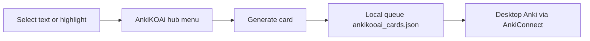
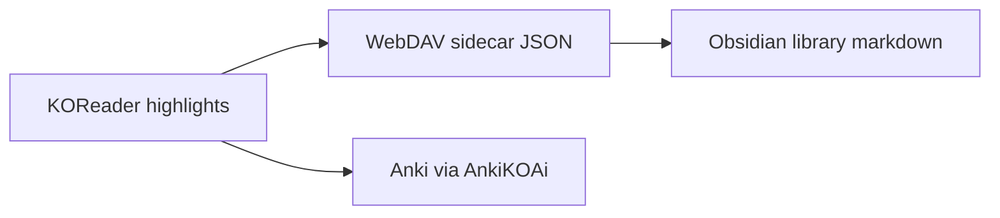

# AnkiKOAi — short summary of the plugin and recent work

## What the plugin is

**AnkiKOAi** ([`AnkiKOAi.koplugin`](../), v1.0.9) is a KOReader plugin that turns reading highlights into Anki cards and sends them over Wi‑Fi via **AnkiConnect**.

**Reading flow:**

**Three card types:**

| Type | What it does |
|------|----------------|
| **Wiki Card (AI)** | Wikipedia/Wiktionary context + AI article on the back |
| **Vocabulary Card** | KOReader dictionary lookup only (no AI) |
| **Memorization Card** | LPCG-style step cards + full recitation for poetry/prose |

**Core Lua modules** (33 files at repo root):

- [`main.lua`](../main.lua) — plugin entry, highlight-menu hooks, card flows
- [`plugin_menu.lua`](../plugin_menu.lua) — AnkiKOAi hub menu
- [`card_generator.lua`](../card_generator.lua) / [`anki_sync.lua`](../anki_sync.lua) — AI generation + AnkiConnect HTTP
- [`card_storage.lua`](../card_storage.lua) / [`card_manager.lua`](../card_manager.lua) — pending queue, My Cards, batch send
- [`highlight_inbox.lua`](../highlight_inbox.lua) — all highlights in book, multi-select, batch send/delete
- [`settings_viewer.lua`](../settings_viewer.lua) — on-device settings (API keys, decks, note types)
- [`selectable_menu.lua`](../selectable_menu.lua) — reusable checklist UI (select all, delete selected)

**Highlight colors:** orange = pending in queue; green = sent to Anki (wiki). Tap green wiki highlights for “see Recently sent,” not the card viewer.

**Dev setup:** WSL emulator via [`dev-start.sh`](../dev-start.sh); test book `alice.epub`; syncs plugin into `~/koreader-dev/plugins/`.

---

## Companion: TagBankHighlightSync

Not part of AnkiKOAi itself, but used alongside it in a typical setup (`tagbankhighlightsync.koplugin` sibling repo):

- Tags highlights, syncs `*.sdr.json` to WebDAV, exports Obsidian library (`library/quotes/`, `tags/`, `books/`)
- When **both** plugins are installed, TagBank settings use Anki-branded labels for orange/green filters; alone, labels stay neutral (`plugin_peers.lua` in TagBank repo)

Obsidian export is **one-way** (KOReader → WebDAV → markdown). Delete-in-Obsidian with KOReader sync is not built yet.

---

## Recent session work

### AnkiKOAi

1. **View All Highlights** — direct entry on the highlight menu and in the AnkiKOAi hub; opens [`highlight_inbox.lua`](../highlight_inbox.lua) checklist (select + delete + batch Anki send). Files: [`main.lua`](../main.lua), [`plugin_menu.lua`](../plugin_menu.lua), [`plugin_constants.lua`](../plugin_constants.lua).

2. **Alice reset tooling** — [`scripts/reset_alice.sh`](../scripts/reset_alice.sh) orchestrates PC-only clean slate: Anki notes, local card queue, epub/sidecars, WebDAV JSON, Obsidian library purge, regen, fresh epub download.

3. **Highlight cleanup** — [`highlight_cleanup.lua`](../highlight_cleanup.lua) removes orphan orange vocab/mem highlights after background Anki send (with spec).

### TagBankHighlightSync

4. **Screenshot capture fix (Windows Desktop)** — `highlight_capture.lua`: stopped comparing KOReader color userdata to `nil` with `==` (crashed on BBRGB32); fixed `blitFrom` arg order; plain-text capture path.

5. **Untagged Sync now** — library export for untagged highlights without requiring tags; unified upload/toast logic.

6. **TagBank / Anki decoupling** — conditional settings labels when AnkiKOAi present vs absent.

7. **WebDAV 404 on missing sidecar** — `cloudstorage_compat.lua`: remove bad `.temp` body after 404 so merge does not log invalid JSON (seen after Alice reset).

8. **Library regen script** — `spec/regen_library_from_json.lua` in TagBank repo: rebuild Obsidian `library/` from remaining WebDAV JSON sidecars (excludes Alice); wipes stale deploy dirs before copy.

### Alice clean-slate reset (executed)

- Removed Alice from Anki (15 notes via AnkiConnect at LAN IP), WebDAV, Obsidian library, local sidecars
- Regenerated library from 3 remaining books (Demons, Lucid Dreaming, Meditations)
- Fresh `alice.epub` from Gutenberg cache (~136 KB) for dev/emulator testing

### Discussed but not implemented

- Obsidian **delete/copy buttons** next to quotes (would need Obsidian plugins or reverse sync to WebDAV JSON)
- True **delete-from-Obsidian** that propagates to KOReader (architecturally possible, not built)

---

## How to use the main features today

| Goal | Path |
|------|------|
| Create a card from selection | Highlight menu → **AnkiKOAi** → card type |
| View/delete all highlights in book | Highlight menu → **View All Highlights** (or AnkiKOAi hub → same) |
| Pending queue / batch send | **AnkiKOAi → My Cards** or **Highlights and Cards** |
| Tagged quotes → Obsidian | TagBank sync (separate plugin); vault = WebDAV `library/` |
| Dev test | `bash dev-start.sh --emulator alice.epub` |

---

## Repo state note

Much of the recent work above may be **uncommitted** local changes across both plugins. Never commit `configuration.lua`, `LOCAL_DEV.md`, or API keys.
